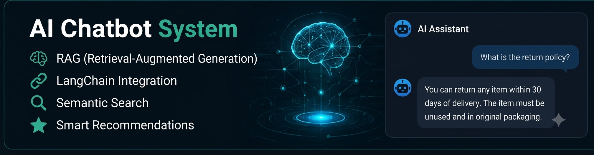
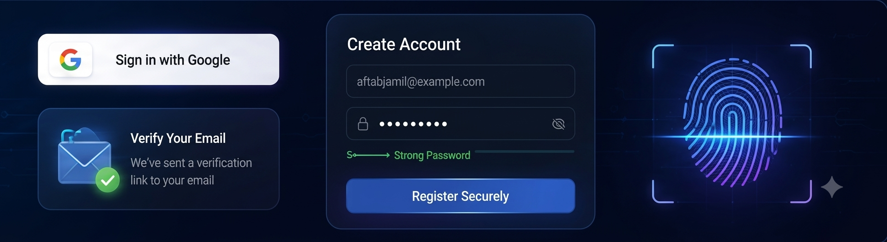
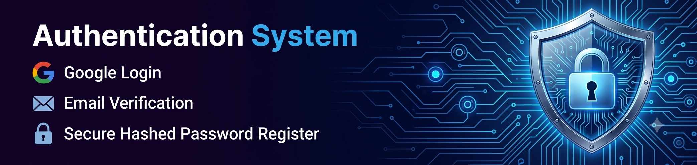
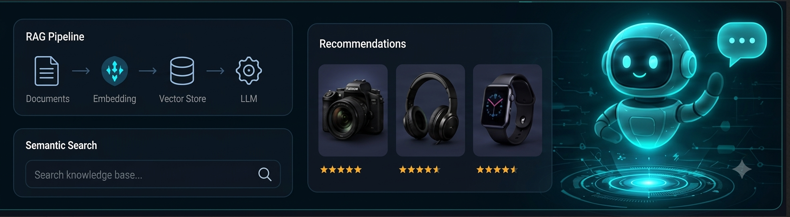
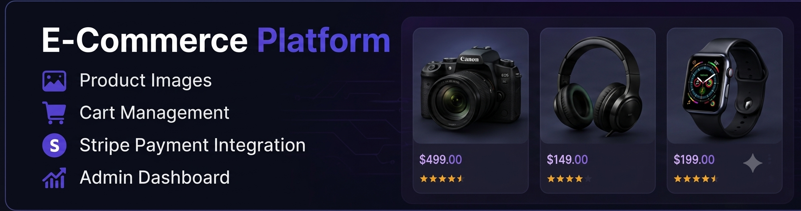
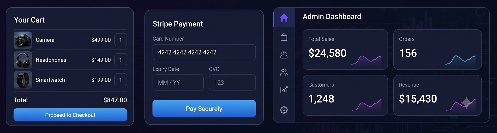

  

    

      
    

    

      
    

    

      
    

    

      
    

    

      
    

    

      
    

  

<!-- BADGE BUTTONS -->
  
  
  
    

  <!-- METRICS SHIELD BADGES -->
  
  
  

---

## 👨‍💻 Deployment Profile

> "Solving real-world problems with clean, scalable code and continuous innovation."

I'm **Aftab Jamil**, a passionate **Full-Stack Web Developer** specializing in building modern, production-ready web applications using the **MERN Stack** (MongoDB, Express.js, React.js, Node.js). Currently engineering intelligent web solutions using **Retrieval-Augmented Generation (RAG)** and **Generative AI**.

| Category | Detail |
| :--- | :--- |
| 🏛️ **Role** | Full-Stack Web Developer \| MERN Stack & AI Systems Engineer |
| 🏗️ **What I Do** | Design, build, and deploy end-to-end full-stack web applications & AI agent workflows |
| 🎓 **Academic Background** | IT Graduate from **MNS University of Agriculture, Multan (MNSUAM)** |
| ⚙️ **Specialization** | MERN Stack, AI Chatbots (RAG), Vector Databases, RESTful APIs, WebSockets |
| 🚀 **Track Record** | 1.5+ Years of hands-on experience building scalable, high-performance web systems |

---

## 🚀 Featured Projects & Systems

### 🤖 1. AI Chatbot · RAG (Retrieval-Augmented Generation)
> *An intelligent 24/7 AI conversational system powered by Gemini & Ollama with semantic vector search for precise document Q&A.*

#### 🔑 Key Features
* 🧠 **LLM Engine:** Powered by Gemini & Ollama for fast, local/cloud-based natural language processing.
* 🔍 **Vector Search & RAG:** High-accuracy semantic search over private documents using specialized vector databases.
* 📄 **Document Q&A:** Instant query handling and document querying without information hallucination.
* ⚙️ **Problem Solved:** Web applications lack instant, automated support for custom knowledge bases.
* 📈 **Impact:** Automated 24/7 support that reduced query response time by up to 80%.

---

### 🛒 2. Full-Stack MERN E-Commerce Platform
> *An enterprise-grade e-commerce application equipped with secure authentication, payment processing, and interactive real-time management.*

#### 🔑 Key Features
* 🔐 **Authentication & Security:** JWT Token + Cookie-based authentication & middleware authorization.
* 📦 **Product Engine:** Advanced search, dynamic product catalog, and responsive shopping cart logic.
* 💳 **Payment & Checkout:** Seamless Stripe payment gateway integration.
* 📊 **Management & Admin:** Full admin dashboard to manage products, inventories, and orders.
* ✉️ **Automated Workflows:** SMTP-driven automated email notifications for orders and updates.
* 🎨 **Modern Frontend:** High-performance, fully responsive UI engineered with React.js & TailwindCSS.

---

### 🌐 3. Next-Gen Social Media Platform
> *A feature-rich social networking workspace enabling real-time community engagement, content sharing, and dynamic user feeds.*

#### 🔑 Key Features
* 👤 **User Management:** Profile creation, customization, and secure OAuth/JWT login access.
* 📝 **Content Publishing:** Post creation supporting rich text and image upload/storage.
* 💬 **Social Interactions:** Real-time post interactions with dynamic Like and Comment modules.
* 🤝 **Network Layer:** Custom Follow & Friend request workflows.
* ⚡ **Real-Time Engine:** Live notification architecture powered by Socket.io.

---

### 💬 4. Real-Time Instant Messenger
> *A modern WhatsApp-style messaging platform engineered for ultra-low latency, real-time communication.*

#### 🔑 Key Features
* ⚡ **WebSockets Engine:** Instant private messaging and active chat rooms using Socket.io.
* 🟢 **Presence & Metrics:** Online/Offline live status badges, typing indicators, and message timestamps.
* 📁 **Media Delivery:** Real-time binary file and image sharing capabilities.
* 📜 **Data Persistence:** Complete chat history storage utilizing optimized MongoDB schemas.

---

## 🛠️ Tech Stack Command Center

### 🤖 AI, LLM & RAG Systems

  
  
  
  

`RAG Pipelines` `Gemini` `Ollama` `Vector Search` `Document Q&A` `LangChain`

### 🌐 Frontend & UI Engineering

  
  
  
  
  

`HTML5` `CSS3` `JavaScript (ES6+)` `React.js` `React Hooks` `Tailwind CSS`

### ⚙️ Backend, APIs & Architecture

  
  
  
  

`Node.js` `Express.js` `REST APIs` `Middleware Architecture` `Socket.io`

### 🗄️ Databases & Storage

  
  

`MongoDB` `Mongoose ORM` `Vector Databases`

### 🔐 Auth, Security & Payments

  
  
  

`JWT Authentication` `OAuth 2.0` `Cookie Auth` `Stripe Integration`

---

## 🌱 Currently Exploring

| Focus | Details |
| :--- | :--- |
| 🤖 **AI Agent Workflows** | Autonomous task execution with LLM agents |
| 🎯 **Prompt Engineering** | Building optimized AI-driven interface prompts |
| ⚡ **Local LLMs & Ollama** | Deploying custom open-source models locally |

---

## ⚡ GitHub Metrics & Live Performance

  
  

---

## 🤝 Strategic Collaborations & Connect

If you're looking for a **Full-Stack Developer** to build, scale, and optimize AI-powered web software, let's connect and build together:

* 💼 **LinkedIn:** [Aftab Jamil](https://www.linkedin.com/in/aftab-jamil-03a95a2b7)
* 📧 **Email:** [aftabjamil760@gmail.com](mailto:aftabjamil760@gmail.com)

---

  ⭐ <i>Always learning, always building.</i> ⭐

